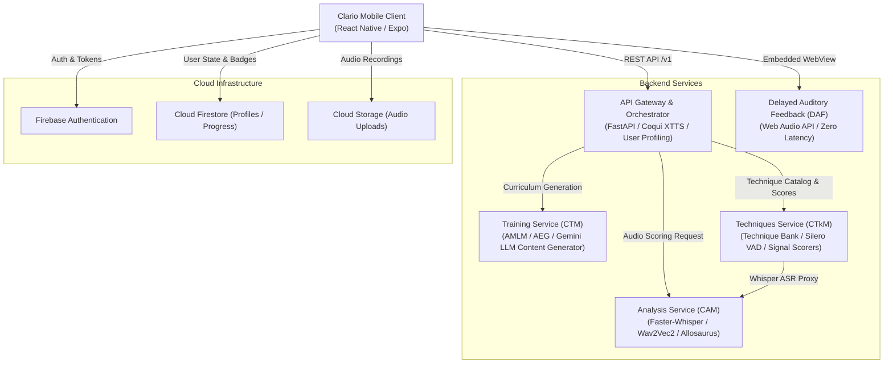

# Clario: Hybrid Speech-Analysis System for Automated Disfluency Detection

Clario is an end-to-end, cross-platform speech therapy and disfluency analysis platform designed to assist individuals with speech sound disorders and fluency impairments (such as stuttering and phonological articulation errors). The platform couples a mobile-first client interface with a microservices-based machine learning back-end, providing objective, real-time acoustic feedback, automated disfluency detection, personalized exercise curricula, and evidence-based speech modification techniques.

The project was developed as a Final Year Project (FYP) for a Bachelor of Science in Artificial Intelligence.

Co-developed by Shaiel ([GitHub](https://github.com/mshaiel) / [HuggingFace](https://huggingface.co/mshaiel2004)) and Junaid ([HuggingFace](https://huggingface.co/junaiddbz) / [GitHub](https://github.com/junaiddbz)).

---

## Demonstration Media

A complete demonstration of the system workflows, including intake triage, bilingual disfluency detection (English and Urdu), exercise execution, and clinical techniques, is cataloged below.

### Primary End-to-End Walkthrough

[](https://www.youtube.com/watch?v=kqI2qXZzhI4)

*Click the image above to view the full video demonstration on YouTube ([Direct Link: youtu.be/kqI2qXZzhI4](https://youtu.be/kqI2qXZzhI4)).*

#### Walkthrough Chapters
- 0:00 - Real-Time Disfluency Analysis: Paragraph Acoustic Screening
- 0:53 - Standard Diagnostic Assessment with Voice AI CoPilot (English)
- 2:04 - Standard Diagnostic Assessment with Voice AI CoPilot (Urdu)
- 3:13 - Personalized Curriculum & Adaptive Exercise Generation (AMLM / AEG / Gemini LLM)
- 6:09 - Clinical Speech Modification Techniques & Real-Time Biofeedback (Silero VAD / Rate & Phonation Scoring)

---

## System Architecture

The architecture consists of a client application communicating via a stateless REST API Gateway with distributed acoustic, curriculum, and clinical technique engines.



---

## Technical Stack

### Frontend
- Framework: React Native with Expo SDK (file-based navigation via Expo Router)
- Languages: TypeScript, JavaScript
- State Management: React Context with custom service hooks
- Animation: React Native Reanimated
- Audio Pipeline: Expo AV, Web Audio API (in-webview DAF)
- Backend Integration: Firebase JS Client SDK (v10), fetch-based REST clients with exponential backoff

### Backend Microservices
- Core Framework: Python 3.10, FastAPI, Uvicorn, Pydantic
- Acoustic Analysis Models:
  - Automatic Speech Recognition: Faster-Whisper (OpenAI Whisper engine)
  - Phonetic Feature Extraction: Allosaurus universal phone recognizer
  - Acoustic Representation: Wav2Vec 2.0 (Facebook/Meta)
  - Voice Activity Detection: Silero VAD
- Training & Content Generation:
  - Latent Representation: Acoustic Multitask Latent Model (AMLM)
  - Target Generator: Acoustic Exercise Generator (AEG)
  - Content Synthesis: Google Gemini API integrated with phonetic syllabification algorithms and SQLite lexicon databases
- Voice Synthesis:
  - High-Fidelity Coaching: Coqui XTTS v2
  - Multilingual Streaming Audio: Edge-TTS with ffmpeg transcoding
- Databases: Cloud Firestore, SQLite (embedded lexicon and technique stores)
- Deployment: Docker, Docker Compose, Hugging Face Spaces

---

## Evaluation Results & Error Analysis

The automated disfluency detection pipeline was evaluated against out-of-domain conversational speech recordings to test real-world clinical viability without synthetic over-fitting.

### Experimental Setup
- Dataset: 200-clip out-of-domain subset extracted from the SEP-28k (Stuttering Events in Podcasts) benchmark dataset.
- Target Labels: Fluency disruptions including acoustic blocks, sound prolongations, and part-word/syllable repetitions.

### Quantitative Metrics
- Macro-F1: 0.177
- Micro-F1: 0.201

### Clinical Error Analysis
A systematic manual audit was conducted on false-negative classifications to determine the root cause of missed disfluency events.

The audit revealed that 74.2% (72 out of 97 audited false negatives) originated from empty or dropped ASR transcriptions produced by the primary speech-to-text layer (Whisper). When speakers experienced prolonged silent blocks or non-standard vocal struggle, standard sequence-to-sequence ASR models interpreted the prolonged silence or dysperiodic phonation as ambient noise and emitted empty token sequences. Consequently, downstream phoneme alignment and heuristic disfluency classifiers received no tokens to evaluate.

This empirical finding demonstrates that traditional pre-trained ASR models fail systematically on atypical speech patterns, underscoring the necessity of dedicated acoustic-level feature extractors (such as direct Wav2Vec2 activations and Silero VAD energy monitoring) alongside standard textual transcripts.

---

## Service Inventory

| Directory | Service Name | Role | Primary Port |
| :--- | :--- | :--- | :--- |
| `frontend/` | Clario Mobile Client | Mobile client for assessments, training, and technique execution | Metro (8081) |
| `backend/api-gateway/` | Clario Unified Assistant (CUA) | Central orchestration gateway, TTS coordination, and user profiles | 8000 (Internal: 7860) |
| `backend/analysis-service/` | Clario Analysis Module (CAM) | ASR, SODA phonology detection, and fluency disruption analysis | 8001 (Internal: 7860) |
| `backend/training-service/` | Clario Training Module (CTM) | Personalized curriculum generation using AMLM, AEG, and Gemini LLM | 8002 (Internal: 7860) |
| `backend/techniques-service/` | Clario Techniques Module (CTkM) | Clinical speech modification techniques, Silero VAD repair detection, and biofeedback | 8003 (Internal: 7860) |
| `backend/daf-service/` | Delayed Auditory Feedback (DAF) | Zero-network-latency on-device auditory delay using Web Audio API | Static Web |
| `firebase/` | Firebase Configuration | Security rules for Firestore and Cloud Storage | Cloud |

---

## Live Deployments & Hugging Face Notice

The backend microservices are hosted on Hugging Face Spaces for demonstration purposes:
- API Gateway: [https://huggingface.co/spaces/junaiddbz/clario-unified-assistant](https://huggingface.co/spaces/junaiddbz/clario-unified-assistant)
- Analysis Service: [https://huggingface.co/spaces/junaiddbz/clario-analysis-module](https://huggingface.co/spaces/junaiddbz/clario-analysis-module)
- Training Service: [https://huggingface.co/spaces/junaiddbz/clario-training-module](https://huggingface.co/spaces/junaiddbz/clario-training-module)
- Techniques Service: [https://huggingface.co/spaces/mshaiel2004/clario-techniques-module](https://huggingface.co/spaces/mshaiel2004/clario-techniques-module)
- DAF Static Host: [https://mshaiel.github.io/clario-daf/daf.html](https://mshaiel.github.io/clario-daf/daf.html)

### Cold-Start Notice
Hugging Face Spaces automatically enter sleep mode after periods of inactivity. Because the Analysis and Techniques services load multi-gigabyte acoustic weights into memory (Faster-Whisper, Allosaurus, and Wav2Vec 2.0), cold-starts may require 2 to 4 minutes while container images initialize and weights transfer to memory. If initial HTTP requests time out, allow the space a short initialization window before retrying.

---

## Data & Security Architecture

The production Firebase instance contains clinical test data and user records that cannot be publicly distributed. The client application is structured to use clean environment variables so that external evaluators can connect their own Firebase environment.

### Access Control Rules
The rules in `firebase/firestore.rules` and `firebase/storage.rules` implement the following safeguards:
- Patient Privacy: Patient records (`/users/{userId}`) and assessment histories are restricted to the authenticated document owner.
- Clinical Role Separation: Authorized therapist accounts are granted read-only oversight to assigned patient profiles without modification rights over historical logs.
- Immutable Sentence Banks: Clinical sentence banks (`/sentence_banks/{bankId}`) are readable by all authenticated patients for practice, while writes are restricted to administrative server credentials.
- Storage Boundaries: Audio submissions in Cloud Storage are limited to audio MIME types and an upper file limit of 15MB.

### Configuring Local Authentication
To run the full authenticated flow locally:
1. Create a Firebase project at https://console.firebase.google.com/.
2. Enable Email/Password in Authentication.
3. Provision Firestore and Cloud Storage.
4. Copy `frontend/.env.example` to `frontend/.env` and insert your Firebase credentials.
5. Note: The provided walkthrough video (https://youtu.be/kqI2qXZzhI4) illustrates the complete data flow, including Firebase-backed state transitions, without requiring local cloud provisioning.

---

## Local Development & Setup

### Option 1: Docker Compose (All Backend Services)

Prerequisites:
- Docker and Docker Compose installed.

1. Create a root environment file:
```bash
cp backend/.env.example .env
```
Ensure `GEMINI_API_KEY` is populated if running training curriculum generation.

2. Launch all backend services:
```bash
docker-compose up --build
```

Service endpoints will be mapped to:
- API Gateway: `http://localhost:8000`
- Analysis Service: `http://localhost:8001`
- Training Service: `http://localhost:8002`
- Techniques Service: `http://localhost:8003`

### Option 2: Running Services Individually

#### Analysis Service
```bash
cd backend/analysis-service
python -m venv venv
source venv/bin/activate  # On Windows: .\venv\Scripts\activate
pip install -r requirements.txt
python download_models.py
uvicorn api.app:app --host 0.0.0.0 --port 7860
```

#### Techniques Service
```bash
cd backend/techniques-service
python -m venv venv
source venv/bin/activate  # On Windows: .\venv\Scripts\activate
pip install -r requirements.txt
python data/seed_db.py
uvicorn main:app --host 0.0.0.0 --port 7860
```

#### Training Service
```bash
cd backend/training-service
python -m venv venv
source venv/bin/activate  # On Windows: .\venv\Scripts\activate
pip install -r requirements.txt
uvicorn main:app --host 0.0.0.0 --port 7860
```

#### API Gateway
```bash
cd backend/api-gateway
python -m venv venv
source venv/bin/activate  # On Windows: .\venv\Scripts\activate
pip install -r requirements.txt
uvicorn main:app --host 0.0.0.0 --port 7860
```

### Option 3: Running the Frontend Client

Prerequisites:
- Node.js (version 18 or 20 recommended)
- Expo CLI (`npm install -g expo-cli`)

1. Install dependencies:
```bash
cd frontend
npm install
```

2. Configure environment:
```bash
cp .env.example .env
# Fill in your Firebase keys and service URLs
```

3. Launch development server:
```bash
npx expo start
```

Press `a` for Android Emulator, `i` for iOS Simulator, or scan the QR code with the Expo Go mobile app.

---

## License & Attribution

This repository is maintained for research and academic evaluation purposes.

Developed by Shaiel and Junaid as an undergraduate final year project in Artificial Intelligence. All clinical technique structures and syllabification models are derived from standard speech-language pathology protocols.
